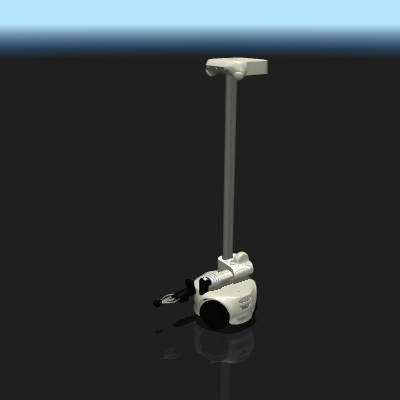

# Hello Robot Stretch 4 Description (MJCF)

> [!IMPORTANT]
> Requires MuJoCo 3.3.0 or later.

## Changelog

See [CHANGELOG.md](./CHANGELOG.md) for a full history of changes.

## Overview

This package contains the robot description (MJCF) of the [Hello Robot Stretch 4](https://hello-robot.com/product) developed by [Hello Robot](https://hello-robot.com/). The model and meshes are derived from [hello-robot/stretch4_mujoco](https://github.com/hello-robot/stretch4_mujoco) under the [Clear BSD License](LICENSE).

  

## Derivation steps

1. Generated the Stretch 4 MJCF from the `stretch4_urdf` package using the upstream `urdf2mjcf` pipeline.
2. Combined `defaults.xml`, the autogenerated body tree, omniwheel bodies, contacts, actuators, sensors, and keyframes into a single `stretch.xml`.
3. Rewrote mesh paths to `assets/` and copied the corresponding visual and collision meshes.
4. Kept source default classes (`visualgeom`, `collision`, `rubber`, `omniwheel_collision`) so visual meshes stay non-colliding, gripper pads keep rubber contact, and the omni wheels keep capsule collision.
5. Applied the Critter project visual materials.
6. Split lidar into a library variant: `stretch.xml` has no lidar, and `stretch_lidar.xml` keeps the head HemiLidar frames/cameras plus the base 360° rangefinder.
7. Added `scene.xml` which includes the robot with a ground plane and the upstream floor-to-wheel contact pairs.

## License

This model is released under a [Clear BSD License](LICENSE).
